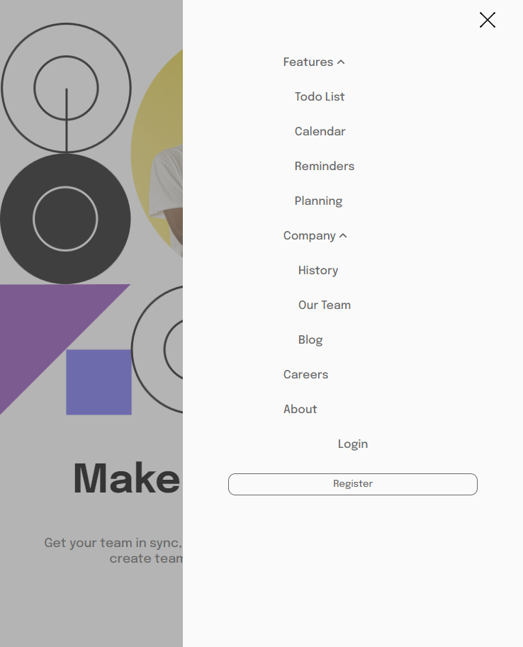

# Frontend Mentor - Interactive card details form solution

This is a solution to the [Intro section with dropdown navigation challenge on Frontend Mentor](https://www.frontendmentor.io/challenges/intro-section-with-dropdown-navigation-ryaPetHE5). Frontend Mentor challenges help you improve your coding skills by building realistic projects. 

## Table of contents

- [Frontend Mentor - Interactive card details form solution](#frontend-mentor---interactive-card-details-form-solution)
    - [Table of contents](#table-of-contents)
    - [Overview](#overview)
        - [The challenge](#the-challenge)
        - [Screenshot](#screenshot)
                - [Desktop View](#desktop-view)
                - [Mobile View](#mobile-view)
        - [Links](#links)
    - [My process](#my-process)
    - [Author](#author)

## Overview

### The challenge

Your users should be able to:

- View the relevant dropdown menus on desktop and mobile when interacting with the navigation links
- View the optimal layout for the content depending on their device's screen size
- See hover states for all interactive elements on the page

### Screenshot

##### Desktop View

##### Mobile View

### Links

- Solution URL: [https://github.com/multiparedes/introSectionWithDropdownMenu](https://github.com/multiparedes/introSectionWithDropdownMenu)
- Live Site URL: [https://intro-section-with-dropdown-menu.vercel.app/](https://intro-section-with-dropdown-menu.vercel.app/)

## My process

In this challenge I practiced mobile navigations bars and a learnt a little more about JS and DOM manipulation, I discovered to select adjacents elements of a section/div with the `nextElementSibling` function, with this I manged to press the link and expand the dropdown menu, I'm proud of it but i'm open to other options :)

I run in a little issue with the mobile menu and where if I expand the dropdown menu with the icons it shifts, I fixed it by just hidding it, if you don't see it, it dosn't exist jeje. 

UPDATE: I just saw a better way of having the gray background on the mobile view without the need of a new div, only with a `box-shadow` that expands to fullscreen when the hamburger menu is pressed. Ty Kevin Powel.

## Author

- Github - [Multiparedes](https://github.com/multiparedes)
- Frontend Mentor - [@multiparedes](https://www.frontendmentor.io/profile/multiparedes)